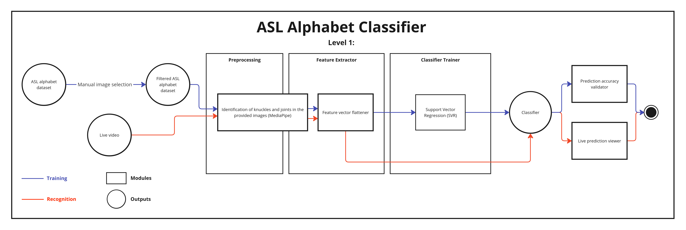
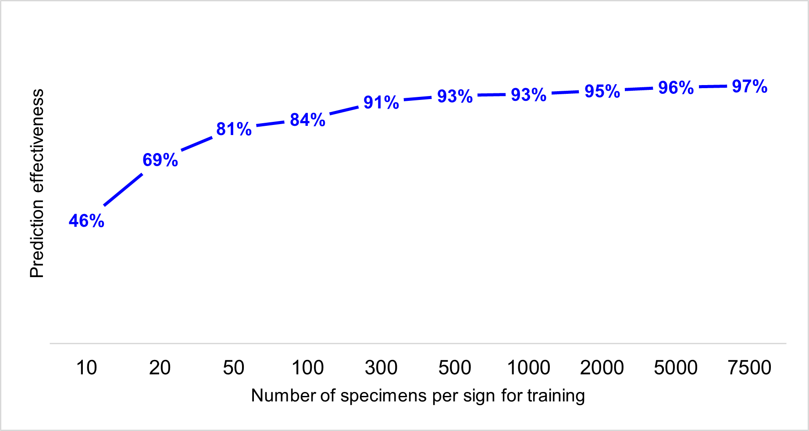
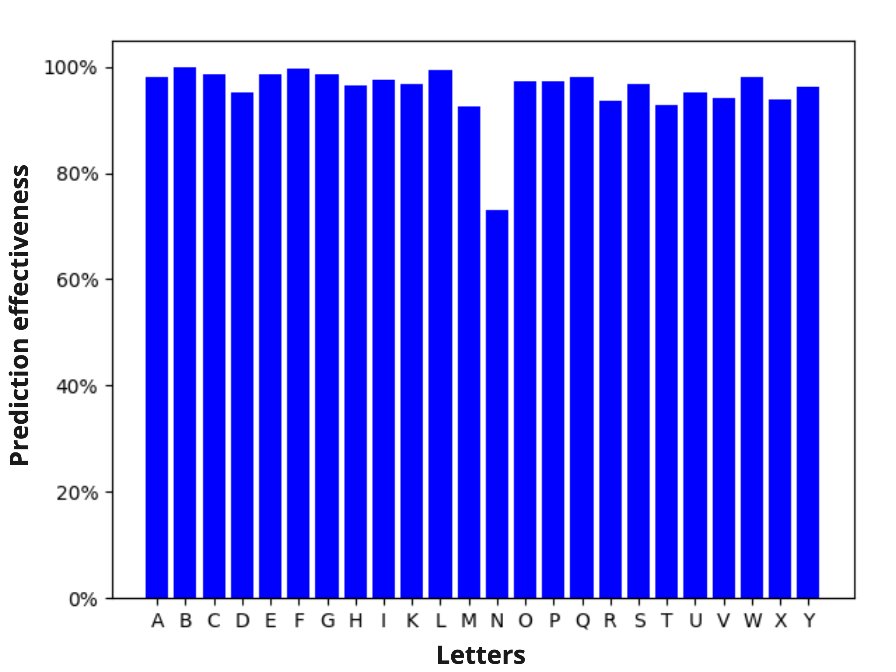
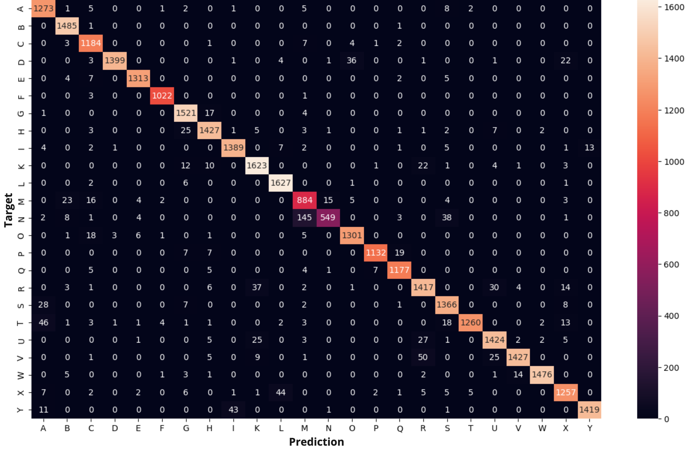

# Real-time sign language translator
 
AI-driven real-time American Sign Language translator. Implemented leveraging Support Vector Machines (SVM), OpenCV library and MediaPipe hands module. 

## Table of contents
* [Real-time sign language translator](#real-time-sign-language-translator)
  * [Project description](#project-description)
    * [Training dataset](#training-dataset)
    * [Architecture](#architecture)
    * [Model validation](#model-validation)
  * [Results](#results)
    * [Prediction effectiveness](#prediction-effectiveness)
    * [Prediction distribution](#prediction-distribution)
  * [Results analysis](#results-analysis)
    * [Prediction effectiveness](#prediction-effectiveness-1)
    * [Prediction distribution](#prediction-distribution-1)
    * [Model confusion](#model-confusion)
  * [Conclusions](#conclusions)
  * [Co-Authors](#co-authors)
  * [License](#license)

## Project description

This documentation is an extract of the final executive technical report of 
the project "Comparison of the Effectiveness of an American Sign Language
(ASL) Recognizer with Implementations Based on Statistical Classification and Support Vector Machines" 
from _Introduction to pattern recognition_ course.

This system was made possible through the combination of state-of-the-art methodologies,
such as computer vision, digital image pre-processing and support vector machines.
The scope of the project encompasses the solution design, implementation and training of the predictive model. 

Here can be found the research paper that presents in-depth documentation of the design and implementation process,
comparative analysis of recognition effectiveness between the implemented models,
findings, recommendations, and conclusions.

### Training dataset

The dataset used for this project is the [ASL (American Sign Language) Alphabet Dataset from Kaggle](https://www.kaggle.com/datasets/debashishsau/aslamerican-sign-language-aplhabet-dataset/data), which contains a collection of images for training on each sign of the _ASL_ alphabet. These images depict hands from various individuals. Each letter of the alphabet is represented by an average of 7,500 images, which exhibit a variety of skin tones and lighting conditions.

To ensure the quality of the data that will feed into the model, the following exclusion criteria were established: 
- **Incomplete images:** Images in which the hand is not fully visible will be removed. 
- **Low-quality images:** Images with excessive digital noise resulting in a "pixelated" appearance will be discarded. 
- **Irrelevant images:** Images in which no hand is present will be excluded.

Additionally, image collections corresponding to the letters "J" and "Z" will be completely discarded, as their representation requires a series of specific movements that cannot be captured in static images. Similarly, images representing deletion and space operations will be removed, as they are not relevant to the proposed recognizer. These measures are aimed at minimizing confusion and maximizing the accuracy of sign identification within the _ASL_.

### Architecture

The proposed architecture begins by gathering data from two sources:
a pre-existing ASL alphabet dataset (training stage) and a live video feed (predicting stage).
Selected images from the dataset and frames from the video are processed by a **Preprocessing Module**,
which identifies hand knuckles and joint points using MediaPipe.

These key points are flattened into feature vectors, which then enter the **Classifier Trainer**,
where a Support Vector Regression (SVR) model is trained to recognize ASL letters.
Once trained, this **Classifier** predicts the alphabet letters from live video feed gestures in real time.

The system includes two outputs:
a **Prediction Accuracy Validator**
to assess model accuracy during training and a **Live Prediction Viewer** to display real-time predictions.
Training and recognition paths are marked in blue and red, respectively.
The result is an efficient, interactive ASL translation tool.

### Model validation
Cross-validation was chosen as the model validation strategy. This method involves dividing the entire dataset into percentages, where 75\% of the specimens are used for model training, and the remaining 25\% are reserved for validation. The split ratio was selected as it constitutes a standard proportion for dataset division.

## Results

### Prediction effectiveness

An incremental approach was applied in the training phase in order to optimize the effectiveness of the support vector regression model in relation to the specimen volume and computational resources required. The results are shown in the table below.

| Specimen Volume | Approximate Effectiveness |
|:---------------:|:-------------------------:|
|       10        |            46%            |
|       20        |            69%            |
|       50        |            81%            |
|       100       |            84%            |
|       200       |            91%            |
|       300       |            93%            |
|      1000       |            93%            |
|      2000       |            95%            |
|      5000       |            96%            |
|      7500       |            97%            |
_TABLE I: Approximate prediction effectiveness of the support vector machine-based model as a function of the number of training specimens._

### Prediction distribution

Based on the previous results, the highest effectiveness was achieved with a training set of 7500 specimens per letter, reaching an **effectiveness level of 97\%**. _TABLE II_ displays this training set and the approximate effectiveness distribution for each letter in the _ASL_ alphabet.

| Letter  | Approximate effectiveness | Letter  | Approximate effectiveness |
|---|---------------------------|---|---------------------------|
| A | 98%                       | N | 73%                       |
| B | 100%                      | O | 97%                       |
| C | 99%                       | P | 97%                       |
| D | 95%                       | Q | 98%                       |
| E | 99%                       | R | 94%                       |
| F | 100%                      | S | 97%                       |
| G | 99%                       | T | 93%                       |
| H | 97%                       | U | 95%                       |
| I | 97%                       | V | 94%                       |
| K | 97%                       | W | 98%                       |
| L | 99%                       | X | 94%                       |
| M | 92%                       | Y | 96%                       |
_Approximate effectiveness distribution of the support vector machine-based recognition model with a training set of 7500 specimens per letter in the ASL alphabet._

## Results analysis

This section presents the analysis of the results outlined in the previous section. The exploration is conducted from a quantitative perspective, focusing on the sub-products of the training and validation stages of the sign recognition model for the ASL alphabet,

### Prediction effectiveness

As a result of the training phase, the values presented in _TABLE I_ demonstrate the prediction effectiveness as a function of the number of specimens used for training the model. These data are represented by a line graph in the following figure.

As shown in chart above, the model reaches its maximum effectiveness rate with 7,500 training specimens for each sign of the ASL alphabet.  Regarding the evolution of the model's effectiveness throughout the training process of the recognizer, a **logarithmic growth** is observed in relation to the volume of training specimens. No decrements in effectiveness are identified as new specimens are added to the training pool.

### Prediction distribution

Once the model is trained, the distribution of effectiveness is analyzed letter by letter for the ASL alphabet. The following figure presents the bar chart corresponding to the data shown in _TABLE II_.

From the figure above, the extreme values are extracted as follows:
- **Best-performing letters:** It is observed that the signs corresponding to the letters "B", "F", and "L" exhibit nearly perfect performance. All three signs have an average accuracy rate exceeding 99\%.
- **Worst-performing letters:** It is noted that the signs corresponding to the letters "N", "M", and "T" demonstrate lower performance in terms of recognition effectiveness by the model. The sign for "N" is the least recognized, with an average effectiveness of 73\%, while the signs for "M" and "T" have average effectiveness rates of 92\%.

Delving into the analysis of the extreme groups regarding the performance of the support vector machine-based recognizer model and their associated signs described above, it is determined that:
- All signs belonging to the best-performing group exhibit a palm orientation facing forward.
- All signs belonging to the worst-performing group are represented by a closed fist.
- It is noteworthy that the signs belonging to the worst-performing group share a high degree of visual similarity and conceal the thumb behind other fingers.
                
### Model confusion

To gain a deeper understanding of the model's strengths and weaknesses, a visualization of the results is proposed in the form of a heat-map using a confusion matrix. This representation can be seen in figure attached bellow.

Regarding the attached confusion matrix a well-defined diagonal is observed with a reasonable level of error distributed across the different classes.

From the visual analysis of the heat-map, a single confusion pattern is extracted, suggesting a specific difficulty faced by the model. This difficulty lies between the signs for the letters "N" and "M", where the recognizer demonstrates a deficiency in discriminating the sign for the letter "N" from that of the letter "M" in the ASL alphabet; however, in the reverse direction, the difficulty is negligible.

## Conclusions

The following are the relevant findings resulting from the implementation, training, and validation experience of the sign recognizer model corresponding to the American Sign Language alphabet.

1. The model achieved a high accuracy of 97% with 7,500 training specimens per letter. The exclusion of incomplete, low-quality, and irrelevant images (such as letters that require motion) was crucial for enhancing model performance, ensuring that the data quality directly impacted prediction accuracy.
2.  The model's recognition effectiveness varied by letter. Letters like "B," "F," and "L" achieved near-perfect recognition (above 99%), attributed to their distinct visual characteristics (forward-facing palms). In contrast, signs like "N," "M," and "T" had lower accuracy, likely due to their closed-fist orientation and similar hand structure, which led to greater confusion.
3.  The model’s confusion matrix highlighted specific challenges, especially in distinguishing similar hand signs, such as "N" and "M." This indicates potential areas for further refinement, such as additional feature engineering or incorporating temporal data for more dynamic gestures that may be less visually distinguishable.
4. The model's effectiveness showed logarithmic growth with the increase in training data. Beyond 3,000 specimens, accuracy improvements diminished, suggesting that the model reaches near-optimal performance before the maximum dataset size, making incremental data additions less impactful on accuracy after a certain threshold.

## Co-Authors

**Andrés Montero Gamboa** 
Computing Engineering Undergraduate 
Instituto Tecnológico de Costa Rica (TEC) 
[LinkedIn](https://www.linkedin.com/in/andres-montero-gamboa) | [GitHub](https://github.com/andresmg07)

**Joshua Gamboa Calvo** 
Computing Engineering Undergraduate 
Instituto Tecnológico de Costa Rica (TEC) 
[LinkedIn](https://www.linkedin.com/in/joshgc19/) | [GitHub](https://github.com/joshgc19)

**Álvaro Moreira Villalobos** 
Computing Engineering Undergraduate 
Instituto Tecnológico de Costa Rica (TEC) 
[GitHub](https://github.com/Newconker)

## License

MIT License

Copyright (c) 2024 Andrés Montero Gamboa

Permission is hereby granted, free of charge, to any person obtaining a copy
of this software and associated documentation files (the "Software"), to deal
in the Software without restriction, including without limitation the rights
to use, copy, modify, merge, publish, distribute, sublicense, and/or sell
copies of the Software, and to permit persons to whom the Software is
furnished to do so, subject to the following conditions:

The above copyright notice and this permission notice shall be included in all
copies or substantial portions of the Software.

THE SOFTWARE IS PROVIDED "AS IS", WITHOUT WARRANTY OF ANY KIND, EXPRESS OR
IMPLIED, INCLUDING BUT NOT LIMITED TO THE WARRANTIES OF MERCHANTABILITY,
FITNESS FOR A PARTICULAR PURPOSE AND NONINFRINGEMENT. IN NO EVENT SHALL THE
AUTHORS OR COPYRIGHT HOLDERS BE LIABLE FOR ANY CLAIM, DAMAGES OR OTHER
LIABILITY, WHETHER IN AN ACTION OF CONTRACT, TORT OR OTHERWISE, ARISING FROM,
OUT OF OR IN CONNECTION WITH THE SOFTWARE OR THE USE OR OTHER DEALINGS IN THE
SOFTWARE.